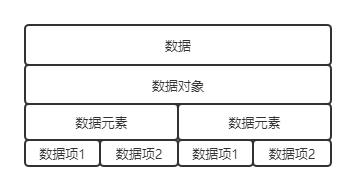

# 第一章 数据结构绪论
> 数据结构是一门研究非数值计算的程序设计问题中的操作对象，以及它们之间的关系和操作等相关问题的学科。
## 一、基本概念和术语
**数据**：是描述客观数据的符号，是计算机中可以操作的对象，是能被计算机识别，并输入给计算机处理的符号集合

**数据元素**：是组成数据的、有一定意义的基本单位，在计算机中通常作为整体处理。也被称为记录。

**数据项**：一个数据元素可以由若干个数据项组成。数据项是不可分割的最小单位。

**数据对象**：是性质相同的数据元素的集合，是数据的子集。

**数据结构：是相互之间存在一种或多种特定关系的数据元素的集合。**
## 二、逻辑结构和物理结构
### 逻辑结构
**逻辑结构：是指数据对象中数据元素之间的相互关系。**

有四种：集合结构、线性结构、树形结构、图形结构。
**物理结构：是指数据的逻辑结构再计算机中的存储形式**

有两种：顺序存储结构、链式存储结构
- **顺序存储结构：**是把数据元素放在地址连续的存储单元里，其数据间的逻辑关系和物理关系是一致的。
- **链式存储结构:**是把数据元素存放在任意的存储单元里，这组存储单元可以是连续的，也可以是不连续的。数据元素的存储关系并不能反映其逻辑关系，因此需要用一个指针存放数据元素的地址，这样就可以通过地址找到相关元素的位置。

## 三、抽象数据类型
**数据类型：是指一组性质相同的值的集合及定义在此集合上的一些操作的总称。**

**抽象数据类型：是指一个数学模型及定义在该模型上的一组操作。**

## 四、总结回顾
1、数据结构的相关概念：

****
2、数据结构的定义：数据结构是相互之间存在一种或多种特定关系的数据元素的集合。可以从逻辑结构与物理结构两个角度来分

