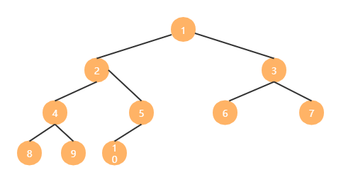
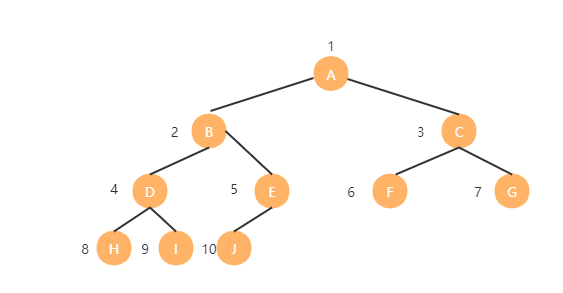

## 树的定义
> 树是n个结点的有限集。n=0时称为空树。在任意一棵非空树中：1、有且仅有一个特定的称为根（Root）的结点；2、当n>1时，其余结点可分为m(m>0)个互不相交的有限集T1、T2、...、Tm，其中每一个集合本身又是一棵树，并且称为根的子树（SubTree）。

### 结点分类
结点拥有的子树数称为结点的度。度为0的结点称为叶结点（Leaf）或终端结点；度不为0的结点称为非终端结点或分支结点。树的度是树内各结点的度的最大值。
### 节点间关系
结点的子树的根称为该结点的孩子（Child），相应地，该结点称为孩子的双亲（Parent）。同一个双亲的孩子之间互称兄弟（Sibling）。结点的祖先是从根到该结点所经分支上的所有结点。结点的祖先是从根结点到该结点所经分支上的所有结点。
### 树的其他概念
结点的层次（Level）从根开始定义起，根为第一层，根的孩子为第二层。树中结点的最大层次称为树的深度（Depth）或高度。
## 树的存储结构
### 双亲表示法
> 在每个结点中附设一个指示器指示其双亲结点到链表中的位置。
### 孩子表示法
>  把每个结点的孩子结点排列起来，以单链表作为存储，则n个结点有n个孩子链表，如果是叶子结点则此单链表为空。然后n个头指针又组成一个线性表，采用顺序存储结构，存放进一个一维数组中。
### 孩子兄弟表示法
> 任意一棵树，它的结点的第一个孩子如果存在就是唯一的，它的兄弟如果存在也是唯一的。因此我们设置两个指针，分别指向该结点的第一个孩子和此结点的右兄弟。

## 二叉树的定义
> 二叉树（Binary Tree）是 n (n>=0)个结点的有限集合，该集合或者为空集（空二叉树），或者由一个根结点和两棵互不相交的、分别称为根结点的左子树和右子树的二叉树组成。

### 二叉树特点
##### 二叉树的特点有：
- 每个结点**最多**有两棵子树，所以二叉树中不存在度大于2的结点。
- 左子树和右子树是有顺序的，次序不能任意颠倒。
- 即使书中某结点只有一棵子树，也要区分它是左子树还是右子树。
##### 二叉树的5种基本形态：
- 1、空二叉树
- 2、只有一个根结点
- 3、根结点只有左子树
- 4、根结点只有右子树
- 5、根结点既有左子树又有右子树

### 特殊二叉树
##### 1、斜树
> 所有的结点都只有左子树的二叉树叫左斜树。所有结点都是只有右子树的二叉树叫右斜树。这两者统称为斜树。
##### 2、满二叉树
> 在一棵二叉树中，如果所有的分支结点都存在左子树和右子树，**并且所有叶子都在同一层上**，这样的二叉树称为满二叉树。
满二叉树的特点：
- 叶子只能出现在最下一层。出现在其他层就不可能达成平衡；
- 非叶子结点的度一定是2。
- 在同样深度的二叉树中，满二叉树的结点个数最多，叶子数最多。
##### 3、完全二叉树
> 对一棵具有n个结点的二叉树按层序编号，如果编号为i（1<=i<=n）的结点与同样深度的满二叉树中编号为i的结点在二叉树中的位置完全相同，则这课二叉树称为完全二叉树。
完全二叉树的特点：
- 叶子结点只能出现在最下两层。
- 最下层的叶子一定集中在左部连续位置。
- 倒数第二层，若有叶子结点，一定都在右部连续位置。
- 如果结点度为1,则该节点只有左孩子，没有右孩子。
- 同样节点数的二叉树，完全二叉树的深度最小。
### 二叉树的性质
- 1、在二叉树的第i层上至多有2i-1个结点（i>=1）
- 2、深度为k的二叉树至多有2k-1个结点（k>=1）
- 3、对任何一棵二叉树T，如果其终端节点数为n0，度为2的结点为n2，则n0=n2+1。因为：
  - 1、n=n0+n1+n2
  - 2、n=分支总数+1
  - 3、分支总数=2n2+n1
  - 所以：n0=n2+1
- 4、具有n个结点的完全二叉树的深度为[log2n]+1，（[x]表示不大于x的最大整数）
- 5、如果对一棵有n个结点的完全二叉树（其深度为[log2n]+1）的结点按层编号（从第1层到第[log2n]+1层，每层从左到右），对任一结点i（1<=1<=n）有
  - 如果i=1，则结点是二叉树的根，无双亲；如果i>1，则其双亲是[i/2]；
  - 如果2i>n，则结点i无左孩子(i为叶子结点)；如果2i<=n，该结点左孩子是结点2i；
  - 如果2i+1>n，则结点i无右孩子；否则其右孩子是结点2i+1。

可以照上图来理解这个性质
### 二叉树的存储结构
##### 1、二叉树的顺序存储结构
顺序存储结构对于树这种一对多的关系结构实现起来是比较困难的。但是因为二叉树是一种特殊的树，由于它的特殊性，使得用顺序结构也可以实现。

二叉树的顺序结构就是用一维数组存储二叉树中的结点，并且结点的存储位置，也就是数组的下标要能体现结点之间的逻辑关系。
如下图这棵完全二叉树：

将这棵二叉树存入到数组中，相应的下标对应同样的位置。如下图：
