## 图的定义
> 图（Graph）是由顶点的有穷非空集合和顶点之间的边的集合组成，通常表示为：G(V,E)，其中，G表示一个图，V是图G中顶点的集合，E是图G中边的集合。
### 注意点
- 线性表中我们把数据元素叫做元素，树中将数据元素叫做结点，**在图中数据元素，我们称之为顶点（Vertex）**。
- 线性表中可以没有数据元素，称为空表。树中可以没有结点，叫做空树。**但是图的顶点集合V有穷非空**，也就是图中不许没有顶点。
- 线性表中，相邻的数据元素之间具有线性关系，树结构中，相邻两层的结点具有层次关系，**而图中，任意两个顶点之间都可能有关系，顶点之间的逻辑关系用边来表示**，边集可以是空。
 ### 各种图定义
 - **无向边**:若顶点Vi到Vj之间的边没有方向，则称这条边为无向边（Edge），用无序偶对(vi,vj)来表示。如果图中任意两个顶点之间的边都是无向边，则称该图为无向图（Undirected graphs）。
 - **有向边**：若从顶点Vi到Vj之间的边有方向，则称这条边为有向边，也称为弧（Arc）。有有序偶对<vi,vj来表示，<vi称为弧尾(Tail)，vj称为弧头(Head)。如果图中任意两顶点之间的边都是有向边，则称该图为有向图（Directed graphs）。
 - **简单图**：不存在顶点到自身的边，且同一条边不重复出现，则称这样的图为简单图。
 - **无向完全图**：任意两个顶点之间都存在边的无向图。
  
  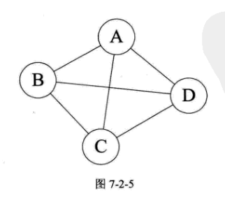

   - **有向完全图**：任意两个顶点之间都存在方向互为相反的两条弧。

  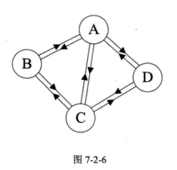

   - **网**：带权的图。

 ### 图的顶点与边间的关系
 **顶点v的度（Degree）：**是和v相关联的边的数目。对于有向图的顶点还分为出度和入度。
 **邻接点：**同一个边的两个点互为邻接点。
**路径：**从一个顶点到另一个顶点所经过的顶点序列。树的路径唯一，但图的路径不唯一，所以有很多求最短路径的算法。
**路径的长度：**路径上的边或弧的数目。
**回路或环（Cycle）:**第一个顶点到最后一个顶点相同的路径
**简单路径**序列中顶点不重复出现的路径称为简单路径。
**简单回路或简单环**除了第一个顶点和最后一个顶点外，其余顶点不重复出现的回路。

### 连通图相关术语
**连通图：**无向图中任意两个顶点都有路径。
**非连通图**存在两个顶点之间没有路径，即不连通。
**连通分量**：无向图中的极大连通子图。
**强连通图**：在有向图中，任意两个顶点都存在双向的路径。
**图的生成树**：一个连通图的生成树是一个极小的连通子图，它含有图中全部的n个顶点，但只有足以构成一棵树的n-1条边。不过n个顶点有n-1条边不一定是生成树，比如一个非连通图中有一部分是环路。因此生成树的前提是一定是连通图。
**有向树**：一个有向图恰有一个顶点的入度为0（根结点）,其余顶点的入度均为1。
**生成森林**：一个有向图的所有顶点，被分为若干棵不相交的有向树，这些树就是有向图的生成森林。
## 图的存储结构
### 1、邻接矩阵
**图的邻接矩阵（Adjacency Matrix）**存储方式是用两个数组来表示图。一个一维数组存储图中顶点信息，一个二维数组（称为邻接矩阵）存储图的边或弧的信息。
以下是一个无向图的邻接矩阵

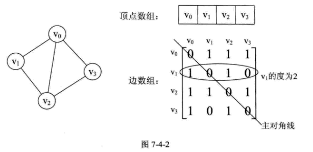

- 矩阵主对角线上的值均为0，因为不存在顶点到自身的边。
- 无向图的边数组是一个对称矩阵
 
 有向图邻接矩阵

 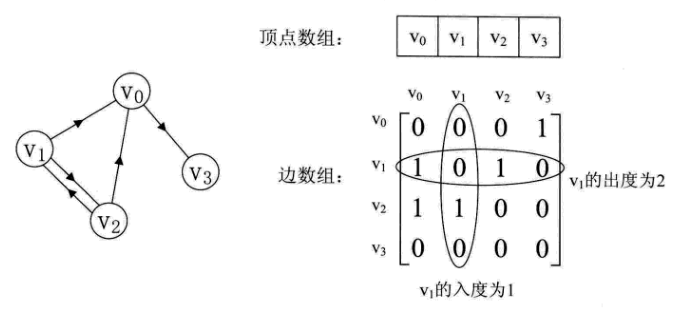
 - 顶点Vi的入度是第Vi列各数之和，出度是Vi行各数之和

网图的邻接矩阵中保存权值，0代表`i=j`，`∞`代表不存在。
 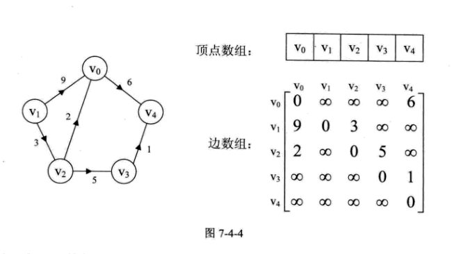

 ### 2、邻接表
 **图的邻接表**：数组与链表结合的图的存储方法。用一个一维数组存储图中的顶点，包括顶点信息和一个指向邻接点单链表的指针。
无向图：

 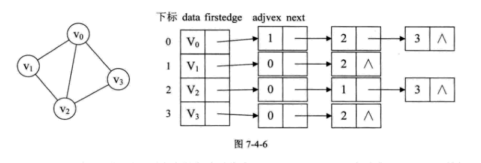

  图中所有的邻接点构成一个线性表，由于邻接点的个数不定，所以用单链表存储。无向图称为顶点Vi的边表，有向图则称为顶点vi作为弧尾的出边表。

有向图：
我们一般以顶点为弧尾来存储表，这样可以容易得到每个顶点的出度。如下图的邻接表：

 

为了便于确认顶点的入度也可以以顶点为弧头来存储边表。我们可以建立一个有向图的逆邻接表，即对每个顶点Vi都建立一个链接为Vi为弧头的表。如上图的逆邻接表。

对于带权值的网图，可以再边表结点定义中再增加一个weight的数据域，存储权值信息。如下图所示：

 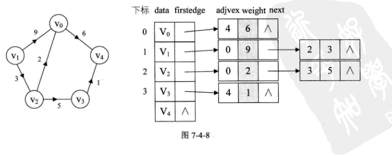

  ### 3、十字链表
  对于有向图来说，邻接表和逆邻接表是有缺陷的，只关注了出度或者入度，想了解另外一个就必须遍历整个图。于是十字链表就是把邻接表跟逆邻接表结合起来。
 
 ##### 顶点表结点结构：

 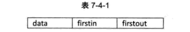

 - firstin表示入边表头指针，指向该顶点的入边表中第一个顶点
 - firstout表示出边表头指针，指向该顶点的出边表中第一个顶点
 ##### 边表结点结构

  

  - tailvex：弧起点在顶点表的下标
  - headvex：弧终点在顶点表中的下标
  - headlink：指入边表指针域，指向终点相同的下一条边
  - taillink：边表指针域，指向起点相同的下一条边。
  - weight：如果是网，可以存储权值

  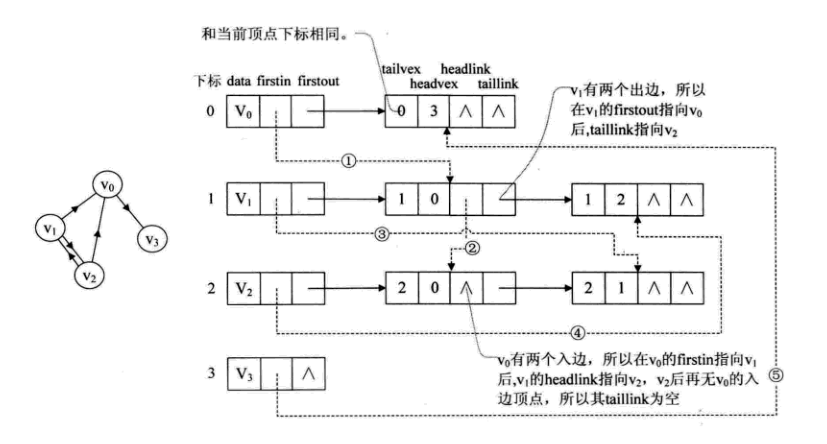

  在有向图的应用中，十字链表是很好的数据结构模型。
  
  ### 4、邻接多重表
无向图的邻接表，对于关注重点是顶点的情况比较实适用，但关注重点是边的操作的情况，需要找到这条边的两个边表进行操作，所以需要邻接多重表进行优化。

重新定义边表结点结构如下：

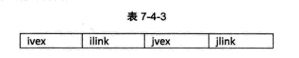

其中ivex和jvex是与某条边依附的两个顶点在顶点表中的下标。ilink指向依附项ivex的下一条边，jlink指向依附顶点jvex的下一条边。这就是邻接多重表结构。

### 5、边集数组
边集数组是由两个一维数组构成。一个是存储顶点的信息；另一个是存储边的信息，这个边数组每个数据元素由一条边的起点下标（begin）、终点下标（end）和权（weight）组成。

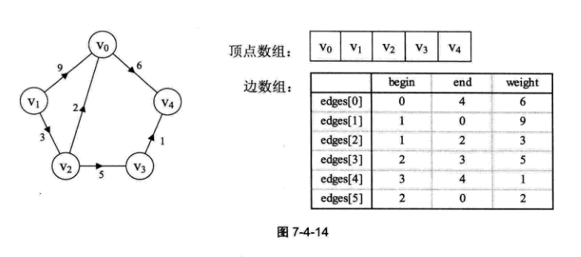

边集数组结构如下：

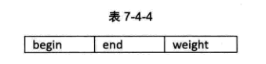

边集数组关注的是边的集合，因此他更适合对边依次进行处理的操作，而不是和对顶点相关的操作。
## 图的遍历
从图的某一顶点出发，访遍图中其余结点且是每个顶点仅被访问一次，这一过程叫做图的遍历（Traversing Graph）。
### 1、深度优先遍历
深度优先遍历（Depth_First_Search），也称为深度优先搜索，简称DFS。

从图中某个顶点v出发，访问此顶点，然后从v的未被访问的邻接点出发深度优先遍历图，直至图中所有和v有路径相通的顶点都被访问到。

对于非连通图，若图中尚有顶点未被访问，则另选图中一个未曾被访问的顶点作为起点，重复上述过程，直至图中所有顶点都被访问到为止。

邻接矩阵的深度优先遍历时间复杂度为O(n2)。
邻接表的深度优先遍历时间复杂度为O(n+e)。
**所以，对于点多变少的稀疏图来说，邻接表算法时间效率高。**

### 2、广度优先遍历
广度优先遍历（Breadth First Search） ，又称为广度优先搜索，简称BFS。

## 最小生成树
构造连同网的最小代价生成树称为最小生成树（Minimum Cost Spanning Tree）。

### 普里姆（Prim）算法
步骤：
- 1、将顶点划为两部分，U(选中部分)，V(未选中部分)；
- 2、每次从两个部分中找出权值最小的边；
- 3、相连的顶点划入到U中；
- 4、重复1，直到顶点全部划入U中；
### 克鲁斯卡尔算法

