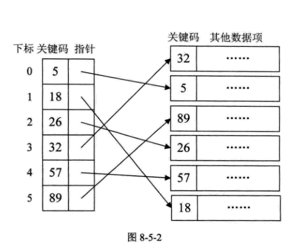
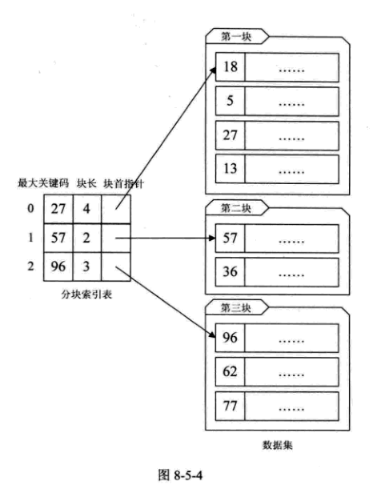
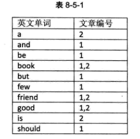
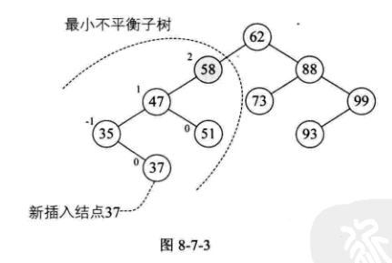
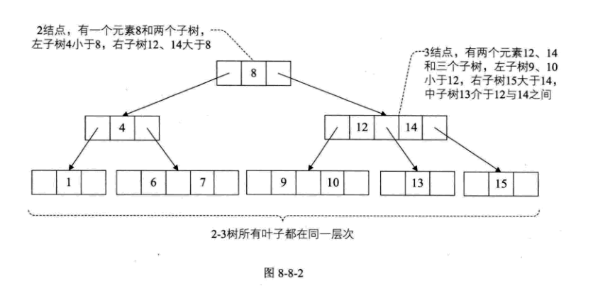

# 查找

## 查找概论

**查找表**是由同一类型的数据元素（或记录）构成的集合。
**关键字**是数据元素中某个数据项的值，又称为键值。若此关键字可以唯一地标识一个记录，则称此关键字为主关键字（Primary Key)。对于可以识别多个数据元素（或记录）的关键字，我们称为次关键字（Secondary Key）。
**查找（searching）**就是根据给定的某个值，在查找表中确定一个其关键字等于给定值的数据元素（或记录）。
**静态查找表（static Search Table）**：只做查找操作的查找表。
**动态查找表（Dynamic Search Table）**:在查找过程中同时插入查找表中不存在的数据元素，或者从查找表中删除已经存在的某个数据元素

## 顺序表查找

顺序查找（Sequential Search）又叫线性查找，是最 基本的查找技术，它的查找过程是：从表中第一个（或最后一个）记录开始，逐个进行记录的关键字和给定值比较，若某个记录的关键字和给定值相等，则查找成功，找到索查的记录。

## 有序表查找

### 折半查找

又称二分查找。前提是线性表中的记录必须是关键码有序，线性表必须采用顺序存储。

> 时间复杂度 O(logn)

### 插值查找（Interpolation Search）

根据要查找的关键字 key 与查找表中最大最小记录的关键字比较厚的查找方法，其核心在于插值的计算公式：`(key-a[low])/a[high]-a[low]`。

对于表长较大，而关键字分布又比较均匀的查找表来说，插值查找算法的平均性能比折半查找要好很多。但是如果是极端不均匀的数据，则不合适。

### 斐波那契查找

## 线性索引查找

线性索引就是将索引项集合组织为线性结构，也称为索引表。有稠密索引、分块索引和倒排索引。

### 稠密索引

> 在线性索引中，将数据集中的每个记录对应一个索引项。对于稠密索引这个索引表来说，索引项一定是按照关键码有序的排列。

### 分块索引

分块有序，把数据集的记录分成了若干块，并且这些块需要满足两个条件：

- **块内无序**，即每一块内的记录不要求有序。
- **块间有序**

对于分块有序的数据集，将每块对应一个索引项，这种索引方法叫做分块索引。分块索引的索引结构分三个数据项：

- **最大关键码**，它存储每一块中的最大关键字。
- 存储了块中的记录个数，以便循环时使用；
- 用于指向块首数据元素的指针，便于开始对这一块中记录进行遍历。

在分块索引表中查找，就是分两步进行：

- 1、在分块索引表中查找关键字所在的块。由于分块索引表是块间有序的，因此很容易利用折半、插值等算法得到结果。
- 2、根据块首指针找到对应的块，并在块中顺序查找关键码。

总的来说，分块索引在兼顾了对细分块不需要有序的情况下，大大增加了整体查找的速度，所以普遍被用于数据库表查找等技术的应用当中。

### 倒排索引

倒排索引项的通用结构是：

- **次关键码**，例如上面的“英文单词”；
- **记录表号表**，例如上面的“文章编号”；

其中记录号表存储具有相同次关键字的所有记录的记录号。这样的索引方法就是**倒排索引**。
这种索引表中的每一项都包括一个属性值和具有该属性值的各记录的地址。由于不是由记录来确定属性值，而是由属性值来确定记录的位置，因而称为倒排索引。

优点是，查找记录非常快，基本等于生成索引表后，查找时都不用去读取记录，就可以得到结果。
缺点是，这个记录号不定长。

### 二叉排序树

二叉排序树又称为二叉查找树。它或者是一棵空树，或者是具有下列性质的二叉树。

- 若它的左子树不空，则左子树上所有结点的值均小于它的根结构的值；
- 若它的右子树不空，则右子树上所有结点的值均大于它的根结构的值；
- 它的左右子树也分别为二叉排序树。

### 平衡二叉树（AVL 树）

平衡二叉树，是一种二叉排序树，其中每一个节点的左子树和右子树的高度差至多等于 1。

将二叉树上结点的左子树深度减去右子树深度的值称为**平衡因子 BF**,那么平衡二叉树上所有结点的平衡因子只可能是-1、0 和 1。

距离插入结点最近的，且平衡因子的绝对值大于 1 的结点为根的子树，我们称为最小不平衡子树。

#### 平衡二叉树实现原理

平衡二叉树构建的基本思想就是在构建二叉排序树的过程中，每当插入一个结点时，先检查是否因插入而破坏了树的平衡性，若是，则找出最小不平衡子树。在保持二叉排序树特性的前提下，调整最下不平衡子树中各结点之间的链接关系，进行相应的旋转，使之成为新的平衡子树。

### 多路查找树（B 树）

#### 1、2-3 树

2-3 树是这样的一棵多路查找树：其中每一个结点都具有两个孩子（2 结点）或三个孩子（3 结点）
一个 2 结点包含一个元素和两个孩子（或没有孩子）；**要么没有孩子，要有就有两个。**
一个 3 结点包含一小一大两个元素和三个孩子（或没有孩子）；**要么没有孩子，要有就有 3 个孩子**.
并且 2-3 树中所有叶子都在同一层次上。

#### 2、2-3-4 树

2-3-4 树是 2-3 树的概念扩展，包括了 4 结点的使用，一个 4 结点包含小中大三个元素和四个孩子（或没有孩子）。一个 4 结点要么没有孩子，要么具有 4 个孩子。

#### 3、B 树

B 树是一种平衡的多路查找树，2-3 树和 2-3-4 树都是 B 树的特例。结点最大的孩子数目称为 B 树的阶（order）。因此 2-3 树是 3 阶的 B 树，2-3-4 树是 4 阶的 B 树。

#### 4、B+树

B+树是应文件系统所需而出的一种 B 树的变形树。在 B 树中，每一个元素在该树中只出现一次，有可能在叶子结点上，也有可能在分支结点上。而在 B+树中，出现在分支结点中的元素会被当做他们在该分支结点位置的中序后继者（叶子结点）中再次列出。另外，每一个叶子结点都会保存一个指向后一叶子结点的指针。

### 散列表查找（哈希表）概述

通过某个函数 f,使得`存储位置=f(关键字)`，那么我们可以通过查找关键字不需要比较久可以获得需要的记录的存储位置。这就是一种新的存储结束——散列技术。

**散列技术是在记录的存储位置和它的关键字之间建立一个确定的对应关系`f`，使得每个关键字`key`对应一个存储位置`f(key)`。**
对应关系 f 称为散列函数，又称为哈希（Hash）函数。采用散列技术将记录存储在一块连续的存储空间中，这块连续存储空间称为散列表或者哈希表（Hash table）。

#### 查找步骤

- 1、在存储时，通过散列函数计算记录的散列地址，并按此散列地址存储该记录。
- 2、当查找纪录时，我们通过同样的散列函数计算记录的散列地址，按此散列地址访问该记录。所以说，**散列表既是一种存储技术，也是一种查找方法。**

  **散列技术最适合的求解问题是查找与给定值相等的记录。**

理想情况下，每一个关键字，通过散列函数计算出来的地址都是不一样的，可现实中，这只是一个理想。我们时长会碰到两个关键字 key1不等于 key2，但是却有 f(key1等于 f(key2)),这种现象我们称为**冲突（collision）**，并把 key1和 key2)称为这个散列函数的同义词（synonym）。

#### 散列函数的构造方法

好散列函数的两个原则：

- **计算简单**。散列函数的计算时间不应该超过其他查找技术与关键字比较的时间。
- **散列地址分布均匀**。这样可以保证存储空间的有效利用，并减少为处理冲突而耗费的时间。

##### 1、直接定址法

取关键字的某个线性函数值为散列地址，即`f(key)=a x key + b（a,b为常数）`
**优点**是简单、均匀、也不会产生冲突，但是需要事先知道关键字的分布情况，适合查找表较小且连续的情况。

##### 2、数字分析法

数字分析法通常适合处理关键字位数比较大的情况，如果事先知道关键字的分布且关键字的若干位分布较均匀，就可以考虑用这个方法。

##### 3、平方取中法

对关键字进行平方运算，并抽取中间 3 位做散列地址。平方取中法比较适合于不知道关键字的分布，而位数又不是很大的情况。

##### 4、折叠法

折叠法是将关键字从左到右分割成位数相等的几部分，然后将这几部分叠加求和，并按散列表表长，取后几位作为散列地址。

折叠法事先不需要知道关键字的分布，适合关键字位数较多的情况。

##### 5、除留余数法

此方法是最常用的构造散列函数的方法。对于散列表长为 m 的散列公式为：`f(key)=key mode p (p<=m)`。这个方法不仅可以对关键字直接取模，也可以在折叠、平方取中后再取模。关键在于选取 p。
经验是，若散列表表长为 m，通常 p 为小于或等于表长（最好接近 m）的最小质数或不包含小于 20 质因子的合数。

##### 6、随机数法

选择一个随机数，取关键字的随机函数值为它的散列地址。也就是`f(key)=random(key)`。这里 random 是随机函数。
当关键字的长度不等时，这个方法比较合适。

#### 处理散列冲突的方法

##### 1、开放定址法

一旦发生了冲突，就去寻找下一个空的散列地址，只要散列表足够大，空的散列地址总能找到，并将记录存下。公式是 fi(key) = (f(key)+di) MOD m (di=1,2,3,4,.....m-1)

解决冲突的开放定址法称为线性探测法。

本来不是同义词却需要争夺一个地址的情况，我们称这种现象为**堆积**。

增加平方运算称为二次探测法。为了不让关键字都聚集在某一区域。

##### 2、再散列函数法

##### 3、链地址法

##### 4、公共溢出区法

#### 散列表查找实现

##### 查找性能分析

- 散列函数是否均匀
- 处理冲突的方法
- 散列表的装填因子
