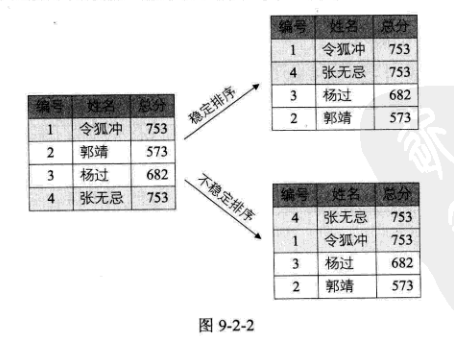
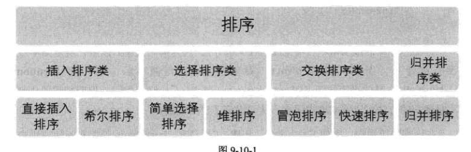

## 定义

### 排序的稳定性

假如两个记录关键字相等，如果排序后两者先后次序不变，则称所用的排序方法是稳定的，反之，如果**可能**使得排序后次序变化，则称该排序方法是不稳定的。

排序方法是否稳定，要通过分析后才能得出。

### 内排序与外排序

根据在排序过程中待排序的记录是否全部被放置在内存中，排序分为内排序和外排序。

内排序是在整个排序过程中，待排序的所有记录全部被放置在内存中。外排序是由于排序的记录的个数太多，不能同时放置在内存，整个排序过程需要在内外存之间多次交换数据才行。

对于内排序，性能主要受**3**个方面的影响：

- **1、时间性能**，高效率的内排序算法应该是具有尽可能少的关键字比较次数和尽可能少的记录移动次数。
- **2、辅助空间**，辅助存储空间是除了存放待排序所占用的存储空间之外，执行算法所需要的其他存储空间。
- **3、算法的复杂性**，算法本身的复杂度。

我们把**内排序分为：插入排序、交换排序、选择排序和归并排序。**

我们学习七种排序算法

- 简单算法：冒泡排序、简单选择排序、直接插入排序
- 改进算法：希尔排序、堆排序、归并排序、快速排序

## 1、冒泡排序

> 冒泡排序是一种交换排序，它的基本思路是：两两比较相邻记录的关键字，如果反序则交换，直到没有反序的记录为止。

> 时间复杂度 O(n2)

## 2、简单选择排序

> 通过`n-i`次关键字间的比较，从`n-i+1`个记录中选出关键字最小的记录，并和第`i（1<=i<=n）`个记录交换之。

> 时间复杂度 O(n2),但是性能优于冒泡排序

## 3、直接插入排序

> 直接插入排序的基本操作是将一个记录插入到已经排好序的有序表中，从而得到一个新的、记录数增 1 的有序表。

> 时间复杂度 O(n2),但是性能优于冒泡麦序和简单选择排序

## 4、希尔排序

> 将相距某个“增量”的记录组成一个子序列，然后在子序列内分别进行直接插入排序，得到基本有序的结果。增量序列的最后一个增量值必须等于 1.

> 时间复杂度 O(n3/2),但是性能优于冒泡麦序和简单选择排序

## 5、堆排序

堆是具有下列性质的完全二叉树： 每个结点的值都大于或等于其左右孩子结点的值，称为大顶堆。或者每个结点的值都小于或等于其左右孩子结点的值，称为小顶堆。

> 堆排序就是利用堆进行排序的方法。基本思想是，将待排序的序列构成一个大顶堆。此时，这个序列的最大值就是堆顶的根结点。将它移走，然后将剩余的 n-1 个序列重新构造成一个对，这样就会得到 n 个元素中的次小值。如此反复，最终得到有序序列。

> 时间复杂度为 O(nlogn)。由于初始构建堆所需的比较次数较多，因此，它并不适合待排序序列个数较少的情况。

## 6、归并排序

> 利用归并的思想。假设初始序列含有 n 个记录，则可以看成是 n 个有序的子序列，每个子序列的长度为 1，然后两两归并，得到[n/2]（[x]表示不小于 x 的最小整数）个长度为 2 或 1 的有序子序列；再两两归并，......，如此重复，直至得到一个长度为 n 的有序序列为止，这种排序方法称为 2 路归并排序。
> 时间复杂度为 O(nlogn)。空间复杂度 O(n+logn)。

归并排序是一种比较占用内存，但却效率高且稳定的算法。

## 7、快速排序

> 通过一趟排序将待排记录分割成独立的两部分，其中一部分记录的关键字均比另一部分记录的关键字小，则可分别对这两部分记录继续进行排序，以达到整个序列有序的目的。

> 时间复杂度 O(nlogn)。空间复杂度 O(logn)

可惜的是，由于关键字的比较和交换是跳跃进行的，因此快速排序是一种不稳定的排序算法。

## 8、总结

